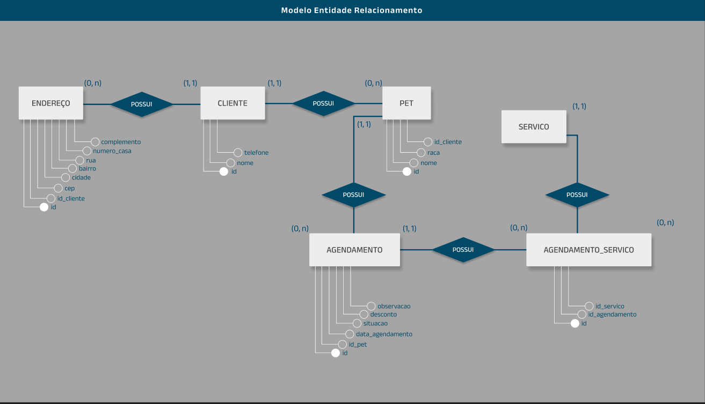
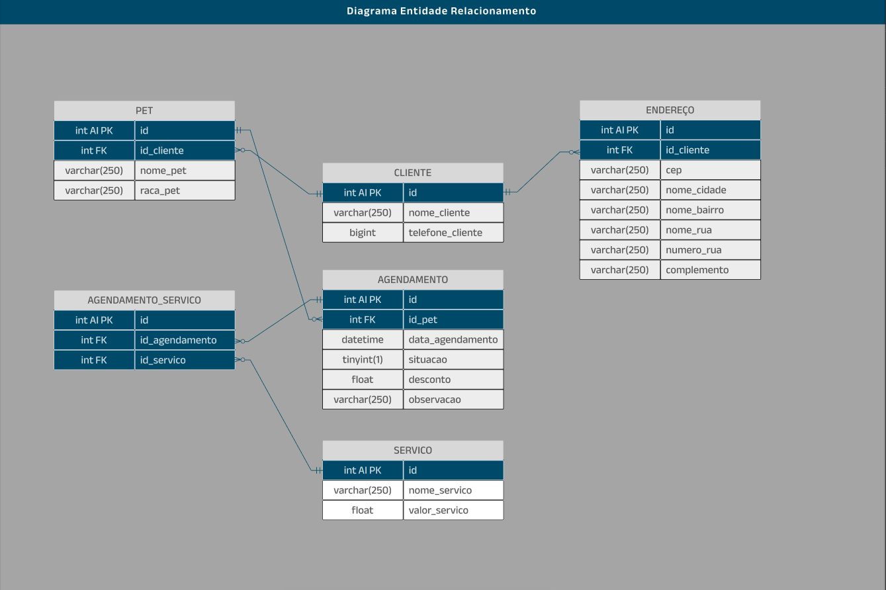
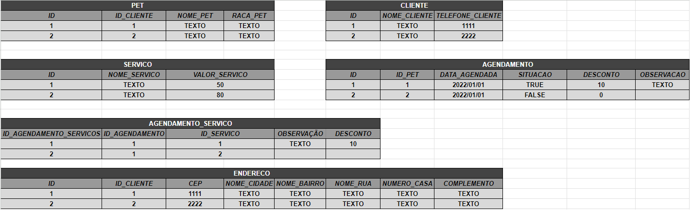

# **DOCUMENTAÇÃO PROJETO PETSHOP**

### EM DESENVOLVIMENTO...

## _SUMÁRIO DA DOCUMENTAÇÃO_

[OBJETIVO DO PROJETO](#objetivo-do-projeto)

[FUNCIONALIDADES](#funcionalidades)

[TECNOLOGIAS UTILIZADAS](#tecnologias-utilizadas)

[FUNCIONALIDADES](#funcionalidades)

[DEPENDÊNCIAS](#dependências)

[ARQUITETURAS E DIAGRAMAS](#arquiteturas-e-diagramas)

### **_Instalação e configuração:_** // em processo

Passos para configurar o ambiente de desenvolvimento.

### **_Usos:_** //em processo

Como utilizar o software, exemplos de usos

### **_Licenças:_** //em processo

Informações sobre a licença do software.

---

## _OBJETIVO DO PROJETO:_

### _Este é um projeto feito para um **Petshop**, embora seja um projeto de Portfólio, ele também será usado em produção._ _Tem como objetivo ajudar no controle de agendamentos e finanças da empresa._

---

## _FUNCIONALIDADES:_

### **_autenticação com senha:_**

Permitir acesso a somente pessoas autenticadas;

### **_Página principal:_**

agenda com os agendamentos de hoje;

### **_Agenda:_**

Filtros: hoje, semana, mês, dia especifico, por pendentes, por pagos, por cliente e por pet;

### **_*Detalhes do agendamento:*_**

Situação(pago ou pendente), nome e raça do pet, nome do cliente, serviços, valor de cada serviço, data agendada, observação, desconto e valor total;

### **_Edição de agendamentos:_**

Permitir a edição e exclusão de agendamentos existentes;

### **_Cadastro de pets:_**

Um formulário para adicionar novos pets com informações: nome, raça;

### **_Cadastro de clientes:_**

Um formulário para adicionar novos clientes com informações: nome, telefone e endereços;

### **_Cadastro de serviços:_**

Um formulário para adicionar novos serviços, com informações: nome e valor;

### **_Relatórios:_**

Relatórios de serviços realizados, valores pendentes e valores pagos em cada filtro

---

## _TECNOLOGIAS UTILIZADAS_

### _Este projeto atualmente será produzido com as seguintes tecnologias:_

- **_BACK-END:_** Node.js;

- **_FRAMEWORK BACK-END:_** Express;

- **_BANCO DE DADOS:_** MySQL;

- **_ORM:_** sequelize;

- **_FRONTEND:_** React.js;

- **_FRAMEWORK FRONT-END:_** Next.js;

- **_VERSIONAMENTO:_** Git/GitHub;

- **_HOSPEDAGEM FRONT-END:_** Vercel;

- **_HOSPEDAGEM BACK-END:_** Vercel;

- **_HOSPEDAGEM BANCO DE DADOS:_** verificando...;

- **_TESTES AUTOMATIZADOS E DE INTEGRAÇÃO:_** Jest/Testing Library;

- **_CRIAÇÃO DE DESIGN:_** Figma;

- **_LINGUAGEM USADA:_** TypeScript;

---

## _CONFIGURAÇÕES_

_Neste projeto, comecei rodando o npm init para criar o arquivo **'PACKAGE.JSON'** e **'PACKAGE-LOCK.JSON'**. após fazer isso, eu instalei algumas **'DEPENDERIAS INICIAIS DO PROJETO.'** Até o momento elas são:_

### **_DEPENDÊNCIAS_**

- **express:** Framework para criação de API;
- **dotenv:** Uso de variáveis de ambiente;
- **bcrypt:** criptografar/descriptografar senhas;
- **cookie-parser:** Analisar cookies vindos por requisições;
- **cors:** Usar frontend e backend na mesma maquina;
- **date-fns:** Extrair datas complexas;
- **joi:** Sanitização/filtro de dados recebidos via Json;
- **jsonwebtoken:** Criar Token para uso de autenticação ;
- **mysql:** Usar banco MySQL puro ;
- **mysql2:** Usar banco MySQL através do Sequelize;
- **sequelize:** Uso de queris SQL através de métodos simplificados;

---

- Como este projeto será codificado em TypeScript, eu instalei algumas dependências especificas para seu uso.

### **_DEPENDÊNCIAS DE DESENVOLVIMENTO_**

- **_@types/express:_** Para o TypeScript entender os tipos do express;
- **_@types/node:_** Para o TypeScript entender os tipos do Node.js;
- **_TSX:_** Para compilação automática do TypeScript ao salvar;
- **_@types/mysql:_** Para o TypeScript entender os tipos do MySQL;
- **_types/jsonwebtoken:_** Para o TypeScript entender os tipos do Json Web Token;
- **_types/cors:_** Para o TypeScript entender os tipos do Cors;
- **_types/bcrypt:_** Para o TypeScript entender os tipos do bcrypt;

### **_DIRETÓRIOS/ARQUIVOS_**

Criei um diretório chamado **_backend_** para armazenar toda a lógica do próprio backend, dentro dele criei os seguintes **DIRETÓRIOS**:

- **_dist:_** É a pasta onde contem o arquivo index.js, que é o index.ts compilado em JavaScript;
- **_node_modules:_** Usado para permitir uso dos módulos de terceiros;
- **_src:_** Local onde estão os principais códigos deste app;

### **_ARQUIVOS GLOBAIS_**

- **_.env:_** Para armazenar as variáveis de ambientes que usarei;
- **_.gitignore:_** Para ignorar alguns arquivos que não serão versionados no git;
- **_package-lock.json:_** Armazenar todas as dependências e dependências das dependências;
- **_package.json:_** Armazenar informações do projeto, dos módulos instalados e configurar scripts;
- **_tsconfig.json:_** Configurações do TypeScript;
- **_vercel.json:_** Arquivo para configurar o uso do backend com node.js na vercel.

### **_PACKAGE.JSON SCRIPTS_**

Criei 1 script até o momento, que é:

- **_dev_**: "tsx watch src/index.ts": Usado em desenvolvimento para compilar e rodar o TypeScript automaticamente quando algum arquivo editado é salvo;

### **_TSCONFIG.JSON CONFIGURAÇÕES FEITAS_**

Fiz algumas configurações para o TypeScript entender o Node.js corretamente, são elas:

- **_"target": "es2020":_** Para usar a versão do JavaScript de 2020;

---

- **_"module": "ESNext":_** Usado pelos seguintes motivos:
- Sintaxe Moderna: Permite o uso de features modernas de módulos, como import e export, que facilitam a organização e a reutilização de código;
- Compatibilidade Futura: Ao utilizar ESNext, você se prepara para usar as futuras funcionalidades de módulos que forem adicionadas ao ECMAScript;
- Interoperabilidade: Facilita a integração com outras bibliotecas e frameworks que utilizam módulos ES;

  ***

- **_"moduleResolution": "node10":_** Usado para ter compatibilidade com projetos Node.js mais antigos: Se você estiver trabalhando em um projeto que utiliza o Node.js versão 10 ou inferior, essa configuração garante que a resolução de módulos seja feita de forma consistente com o ambiente de execução.
  Projetos que utilizam principalmente CommonJS;

---

- **_"outDir": "./src/dist":_** Indica que todos os arquivos JavaScript gerados pela compilação do TypeScript serão colocados dentro de uma subpasta chamada dist dentro do diretório src;

## _ARQUITETURAS E DIAGRAMAS_

### **_BANCO DE DADOS SQL_**

Antes de entrar na arquitetura do backend, criei a arquitetura do banco de dados.

Eu comecei pelas entidades PET, CLIENTE, AGENDAMENTO, SERVICO, AGENDAMENTO_SERVICO;

Fiz um **MER** (Modelo de Entidade e Relacionamento):



Em seguida, fiz o **DER** (Diagrama de Entidade e Relacionamento), que é mais detalhado e mais próximo do resultado final do banco de dados.



Criei também um modelo em excel para exemplificar como está o banco no DB.



## **_BACK-END_**

comecei criando os diretório seguido a arquitetura MVC, porém sem o uso de 'Views', Pois o frontend será separado do backend.

neste projeto utilizei o Sequelize para facilitar o uso do MySQL.

Criei os Modelos/Models, as Rotas/Routes e os Controladores/Controllers.

#### **_FUNCIONALIDADES_**

_Associações_:

- 1 **cliente** pode ter 0 ou muitos **pets**;
- 1 **cliente** pode ter 0 ou muitos **endereços**;

---

- 1 **endereço** pertence a 1 e apenas 1 **cliente**;

---

- 1 **pet** pertence 1 e apenas 1 **cliente**;
- 1 **pet** pode ter 0 ou muitos **agendamentos**;

---

- 1 **agendamento** pertence 1 e apenas 1 **pet**;
- 1 **agendamento** pode ter 0 ou muitos **agendamento_servico**;

---

- 1 **agendamento_servico** pertence 1 e apenas 1 **agendamento**;
- 1 **agendamento_servico** pertence a 1 e apenas 1 **servico**;

---

- 1 **servico** pode ter 1 ou muitos **agendamento_servico**;

#### _ROTAS_:

Rotas serão exemplificadas utilizando o localhost, então é necessário substituir para o endereço correto para testar.

Alguns retornos da API não foram detalhados, pois são consistentes com os exemplos apresentados e seguem o mesmo padrão, e optei por diminuir a redundância.

#### Clientes

- criar (_via Json_);
- ler todos;
- ler por id (_via params_);
- atualizar (_via Json_);
- deletar (_via params_).

  ##### através das seguintes rotas:

- http://localhost:5000/petshop/clientes/create

- http://localhost:5000/petshop/clientes

- http://localhost:5000/petshop/clientes/1

- http://localhost:5000/petshop/clientes/update

- http://localhost:5000/petshop/clientes/delete/1

---

##### CREATE:

Para criação de cliente é necessário um nome com pelo menos 3 caracteres, e um numero de telefone entre 10 e 11 dígitos.
O endereço do cliente tem sua própria rota para criação.

exemplo de uso correto:

```json
{
  "nome_cliente": "teste",
  "telefone": "11112222333"
}
```

Exemplos de erros na criação:

```json
{
  "message": "Dados inválidos.",
  "errorMessage": ["Telefone informado está inválido ou não existe."]
}
```

```json
{
  "message": "Dados inválidos.",
  "errorMessage": ["Nome informado está inválido ou não existe."]
}
```

Caso esteja no formato correto validado pelo Joi, o cliente será criado.

```json
{
  "message": "Cliente criado com sucesso.",
  "data": {
    "id": 3,
    "nome_cliente": "João",
    "telefone_cliente": 11112222333,
    "updatedAt": "2024-09-07T14:18:12.733Z",
    "createdAt": "2024-09-07T14:18:12.733Z"
  }
}
```

Caso haja outro cliente com o mesmo nome ou telefone, você receberá uma mensagem de erro, e receberá o cliente que possui os dados:

```json
{
  "message": "Já existe um cliente com este nome.",
  "data": {
    "id": 3,
    "nome_cliente": "João",
    "telefone_cliente": 11112222333,
    "createdAt": "2024-09-07T14:18:12.000Z",
    "updatedAt": "2024-09-07T14:18:12.000Z"
  }
}
```

```json
{
  "message": "Já existe um cliente com este telefone.",
  "data": {
    "id": 3,
    "nome_cliente": "João",
    "telefone_cliente": 11112222333,
    "createdAt": "2024-09-07T14:18:12.000Z",
    "updatedAt": "2024-09-07T14:18:12.000Z"
  }
}
```

---

##### READ:

A leitura irá trazer os pets e os endereços caso o cliente possua, se não trará um array vazio.

Exemplo de cliente com pets e endereço:

```json
{
  "message": "Cliente resgatado com sucesso.",
  "data": {
    "id": 1,
    "nome_cliente": "Lorena",
    "telefone_cliente": 41988888888,
    "createdAt": "2024-09-06T20:43:56.000Z",
    "updatedAt": "2024-09-06T20:43:56.000Z",
    "pets": [
      {
        "id": 1,
        "nome_pet": "Léo",
        "raca_pet": "Calopsita",
        "id_cliente": 1,
        "createdAt": "2024-09-06T20:44:12.000Z",
        "updatedAt": "2024-09-06T20:44:12.000Z"
      },
      {
        "id": 2,
        "nome_pet": "Ivan",
        "raca_pet": "Gato comum",
        "id_cliente": 1,
        "createdAt": "2024-09-06T20:47:14.000Z",
        "updatedAt": "2024-09-06T20:47:14.000Z"
      },
      {
        "id": 3,
        "nome_pet": "Jack",
        "raca_pet": "Gato comum",
        "id_cliente": 1,
        "createdAt": "2024-09-06T20:49:04.000Z",
        "updatedAt": "2024-09-06T20:49:04.000Z"
      }
    ],
    "enderecos_clientes": [
      {
        "id": 1,
        "id_cliente": 1,
        "cep": "12345-123",
        "nome_cidade": "Curitiba",
        "nome_bairro": "Bigorrilho",
        "nome_rua": "Rua padre anchieta",
        "numero_casa": "2023",
        "complemento": "Apartamento"
      }
    ],
    "hasPet": true
  }
}
```

Exemplo de cliente sem pets e endereço:

```json
{
  "message": "Cliente resgatado com sucesso.",
  "data": {
    "id": 2,
    "nome_cliente": "Lucas",
    "telefone_cliente": 41998134441,
    "createdAt": "2024-09-06T21:11:22.000Z",
    "updatedAt": "2024-09-07T00:40:43.000Z",
    "pets": [],
    "enderecos_clientes": [],
    "hasPet": false
  }
}
```

##### UPDATE:

Para atualização de clientes é necessário informar o id e os novos dados.

As validações não permitem salvar a mudança caso o nome ou telefone estejam escritos incorretamente, assim como no create. E também caso haja outro cliente com os mesmos dados.

Exemplo de update

```json
{
  "id": 1,
  "nome": "Lucas Nathan",
  "telefone": "12312312312"
}
```

retorno

```json
{
  "message": "Cliente atualizado com sucesso.",
  "data": {
    "nome_cliente": "Lucas nathan",
    "telefone_cliente": 12312312312
  }
}
```

##### DELETE:

Não é aconselhável deletar um cliente, pois seus pets, endereços e agendamentos serão excluídos juntos. Pois um pet só existe caso seu cliente exista. E o agendamento existe caso exista um pet.
Excluindo um cliente será realizado um efeito cascata de exclusão em todos os seus dependentes.

Exemplo

Para deletar precisa colocar o id no parâmetro da URL.

http://localhost:5000/petshop/clientes/delete/2

Retorno por Json:

```json
{
  "message": "O cliente, seus pets, endereços e agendamentos foram removidos com sucesso.",
  "data": {
    "id": 2,
    "nome_cliente": "Lucas",
    "telefone_cliente": 41998134441,
    "createdAt": "2024-09-06T21:11:22.000Z",
    "updatedAt": "2024-09-07T00:40:43.000Z"
  }
}
```

#### Pets

- criar (_via Json_);
- ler todos;
- ler por id (_via params_);
- atualizar (_via Json_);
- deletar (_via params_).

  ##### através das seguintes rotas:

- http://localhost:5000/petshop/pets/create

- http://localhost:5000/petshop/pets

- http://localhost:5000/petshop/pets/1

- http://localhost:5000/petshop/pets/update

- http://localhost:5000/petshop/pets/delete/1

---

##### CREATE:

Para criação de pets é necessário que exista 1 cliente, um nome com pelo menos 3 caracteres, e uma raça, que pode ser uma string vazia.

Exemplos de erros na criação:

```json
{
  "message": "Dados inválidos.",
  "errorMessage": ["Nome informado está inválido ou não existe."]
}
```

```json
{
  "message": "Dados inválidos.",
  "errorMessage": ["Raça informada está inválida ou não existe."]
}
```

```json
{
  "message": "Dados inválidos.",
  "errorMessage": ["Cliente informado está inválido ou não existe."]
}
```

Caso esteja no formato correto validado pelo Joi, o pet será criado.

```json
{
  "message": "Pet criado com sucesso.",
  "data": {
    "id": 6,
    "nome_pet": "Bob",
    "raca_pet": "Pinscher",
    "id_cliente": 1,
    "createdAt": "2024-09-08T10:50:42.000Z",
    "updatedAt": "2024-09-08T10:50:42.000Z",
    "cliente": {
      "id": 1,
      "nome_cliente": "Lucas nathan",
      "telefone_cliente": 12312312312,
      "createdAt": "2024-09-06T20:43:56.000Z",
      "updatedAt": "2024-09-08T10:22:41.000Z"
    }
  }
}
```

---

##### READ:

A leitura irá trazer os pets e o cliente.

```json
{
  "message": "Pet e seu dono resgatados com sucesso.",
  "data": {
    "id": 1,
    "nome_pet": "Léo",
    "raca_pet": "Calopsita",
    "id_cliente": 1,
    "createdAt": "2024-09-06T20:44:12.000Z",
    "updatedAt": "2024-09-06T20:44:12.000Z",
    "cliente": {
      "id": 1,
      "nome_cliente": "Lucas nathan",
      "telefone_cliente": 12312312312,
      "createdAt": "2024-09-06T20:43:56.000Z",
      "updatedAt": "2024-09-08T10:22:41.000Z"
    }
  }
}
```

##### UPDATE:

Para atualização de pets é necessário informar o id e os novos dados.

As validações não permitem salvar a mudança caso o nome ou raça estejam escritos incorretamente, assim como no create.

Exemplo de update

```json
{
  "id": 1,
  "nome": "Bob",
  "raca": "vira-lata",
  "id_cliente": 1
}
```

retorno

```json
{
  "message": "Pet atualizado com sucesso.",
  "data": {
    "id": 1,
    "nome_pet": "Bob",
    "raca_pet": "Vira-lata",
    "id_cliente": 1,
    "createdAt": "2024-09-06T20:44:12.000Z",
    "updatedAt": "2024-09-08T10:56:23.000Z",
    "cliente": {
      "id": 1,
      "nome_cliente": "Lucas nathan",
      "telefone_cliente": 12312312312,
      "createdAt": "2024-09-06T20:43:56.000Z",
      "updatedAt": "2024-09-08T10:22:41.000Z"
    }
  }
}
```

##### DELETE:

Não é aconselhável deletar um pet, pois seus agendamentos serão excluídos juntos. Porque O agendamento existe caso exista um pet.
Excluindo um pet será realizado um efeito cascata de exclusão em todos os seus dependentes.

Exemplo

Para deletar precisa colocar o id no parâmetro da URL.

http://localhost:5000/petshop/pets/delete/2

Retorno por Json:

```json
{
  "message": "O pet e seus agendamentos foram removidos com sucesso.",
  "data": {
    "id": 1,
    "nome_pet": "Bob",
    "raca_pet": "Vira-lata",
    "id_cliente": 1,
    "createdAt": "2024-09-06T20:44:12.000Z",
    "updatedAt": "2024-09-08T10:56:23.000Z"
  }
}
```

#### Endereços

- criar (_via Json_);
- ler todos;
- ler por id (_via params_);
- atualizar (_via Json_);
- deletar (_via params_).

  ##### através das seguintes rotas:

- http://localhost:5000/petshop/enderecosclientes/create

- http://localhost:5000/petshop/enderecosclientes

- http://localhost:5000/petshop/enderecosclientes/1

- http://localhost:5000/petshop/enderecosclientes/update

- http://localhost:5000/petshop/enderecosclientes/delete/1

---

##### CREATE:

Para criação de endereços é necessário que exista 1 cliente.
campos opcionais: CEP, nome_cidade, nome_bairro,complemento.
campos obrigatórios: id_cliente, nome_rua e numero_casa.

Exemplos de erros na criação:

enviando:

```json
{
  "cep": "",
  "nome_cidade": "",
  "nome_bairro": "",
  "complemento": ""
}
```

erros:

```json
{
  "message": "Dados inválidos.",
  "errorMessage": ["cliente informado está inválido ou não existe."]
}
```

```json
{
  "message": "Dados inválidos.",
  "errorMessage": ["Nome da rua informado está inválido ou não existe."]
}
```

```json
{
  "message": "Dados inválidos.",
  "errorMessage": ["Número da casa informado está inválido ou não existe."]
}
```

Caso esteja no formato correto validado pelo Joi, o endereço será criado.

enviando:

```json
{
  "id_cliente": 1,
  "cep": "",
  "nome_cidade": "",
  "nome_bairro": "",
  "nome_rua": "rua teste",
  "numero_casa": "1",
  "complemento": ""
}
```

```json
{
  "message": "Endereço de cliente criado com sucesso.",
  "data": {
    "id": 2,
    "id_cliente": 1,
    "cep": "",
    "nome_cidade": "",
    "nome_bairro": "",
    "nome_rua": "Rua teste",
    "numero_casa": "1",
    "complemento": "",
    "cliente": {
      "id": 1,
      "nome_cliente": "Lucas nathan",
      "telefone_cliente": 12312312312,
      "createdAt": "2024-09-06T20:43:56.000Z",
      "updatedAt": "2024-09-08T10:22:41.000Z"
    }
  }
}
```

---

##### READ:

A leitura irá trazer somente o endereço, pois não haverá pesquisa por endereço na aplicação.

```json
{
  "message": "Endereço resgatado com sucesso.",
  "data": {
    "id": 1,
    "id_cliente": 1,
    "cep": "",
    "nome_cidade": "Curitiba",
    "nome_bairro": "Bigorrilho",
    "nome_rua": "Rua padre anchieta",
    "numero_casa": "2023",
    "complemento": "Apartamento"
  }
}
```

##### UPDATE:

Para atualização de endereços é necessário informar o id e os novos dados.

As validações não permitem salvar a mudança caso o id_cliente, nome_rua e numero_casa estejam escritos incorretamente, assim como no create.

No update recebemos o cliente pois na aplicação pode ser necessário imprimir o endereço atualizado junto ao cliente.

Exemplo de update:

```json
{
  "id": 1,
  "id_cliente": 1,
  "cep": "",
  "nome_cidade": "curitiba",
  "nome_bairro": "bigorrilho",
  "nome_rua": "rua padre anchieta",
  "numero_casa": "2023",
  "complemento": ""
}
```

retorno

```json
{
  "message": "Endereço de cliente atualizado com sucesso.",
  "data": {
    "id": 1,
    "id_cliente": 1,
    "cep": "",
    "nome_cidade": "Curitiba",
    "nome_bairro": "Bigorrilho",
    "nome_rua": "Rua padre anchieta",
    "numero_casa": "2023",
    "complemento": "",
    "cliente": {
      "id": 1,
      "nome_cliente": "Lucas nathan",
      "telefone_cliente": 12312312312,
      "createdAt": "2024-09-06T20:43:56.000Z",
      "updatedAt": "2024-09-08T10:22:41.000Z"
    }
  }
}
```

##### DELETE:

Para deletar precisa colocar o id no parâmetro da URL.

http://localhost:5000/petshop/enderecosclientes/delete/2

Retorno por Json:

```json
{
  "message": "Endereço de cliente removido com sucesso.",
  "data": {
    "id": 2,
    "id_cliente": 1,
    "cep": "",
    "nome_cidade": "",
    "nome_bairro": "",
    "nome_rua": "Rua teste",
    "numero_casa": "1",
    "complemento": ""
  }
}
```

#### Serviços

- criar (_via Json_);
- ler todos;
- ler por id (_via params_);
- atualizar (_via Json_);
- deletar (_via params_).

  ##### através das seguintes rotas:

- http://localhost:5000/petshop/servicos/create

- http://localhost:5000/petshop/servicos

- http://localhost:5000/petshop/servicos/1

- http://localhost:5000/petshop/servicos/update

- http://localhost:5000/petshop/servicos/delete/1

---

##### CREATE:

campos obrigatórios: nome_servico e valor_servico.
Não é possível agendar dois serviços com o mesmo nome
Exemplos de erros na criação:

enviando:

```json
{
  "nome": "banho",
  "valor": "50"
}
```

erro:

```json
{
  "message": "Este serviço já existe.",
  "data": {
    "id": 1,
    "nome_servico": "banho",
    "valor_servico": "R$ 35,00",
    "createdAt": "06/09/2024, 21:51:36",
    "updatedAt": "06/09/2024, 21:51:50"
  }
}
```

Caso esteja no formato correto validado pelo Joi, e não exista outro com o mesmo nome, o serviço será criado.

enviando:

```json
{
  "nome": "tosa",
  "valor": "50"
}
```

retorno:

```json
{
  "message": "Serviço criado com sucesso.",
  "data": {
    "id": 2,
    "nome_servico": "tosa",
    "valor_servico": "R$ 50,00"
  }
}
```

---

##### READ:

enviando: - http://localhost:5000/petshop/servicos/1

```json
{
  "message": "Serviço resgatado com sucesso!",
  "data": {
    "id": 1,
    "nome_servico": "banho",
    "valor_servico": "R$ 35,00"
  }
}
```

##### UPDATE:

Para atualização de endereços é necessário informar o id e os novos dados.

As validações não permitem salvar a mudança caso o nome_servico, valor_servico estejam escritos incorretamente, assim como no create.

enviando:

```json
{
  "id": 1,
  "nome": "banho",
  "valor": "40"
}
```

retorno:

```json
{
  "message": "Serviço atualizado com sucesso.",
  "data": {
    "id": 1,
    "nome_servico": "banho",
    "valor_servico": "R$ 40,00"
  }
}
```

##### DELETE:

Para deletar precisa colocar o id no parâmetro da URL.

enviando:

http://localhost:5000/petshop/servicos/delete/1

retorno:

```json
{
  "message": "Serviço removido com sucesso.",
  "data": {
    "id": 1,
    "nome_servico": "banho",
    "valor_servico": "R$ 40,00",
    "createdAt": "2024-09-07T00:51:36.000Z",
    "updatedAt": "2024-09-08T11:23:10.000Z"
  }
}
```

#### Agendamentos

- criar (_via Json_);
- ler todos;
- ler por id (_via params_);
- ler de hoje;
- ler da semana;
- ler do mes (_via Json_);
- ler por data (_via Json_);
- ler por pendentes;
- ler por pagos;
- ler por cliente (_via params_);
- ler por pet (_via params_);
- atualizar (_via Json_);
- deletar (_via params_).

  ##### através das seguintes rotas:

- http://localhost:5000/petshop/agendamentos/create

- http://localhost:5000/petshop/agendamentos

- http://localhost:5000/petshop/agendamentos/hoje

- http://localhost:5000/petshop/agendamentos/semana

- http://localhost:5000/petshop/agendamentos/mes

- http://localhost:5000/petshop/agendamentos/data

- http://localhost:5000/petshop/agendamentos/pendentes

- http://localhost:5000/petshop/agendamentos/pagos

- http://localhost:5000/petshop/agendamentos/cliente/1

- http://localhost:5000/petshop/agendamentos/pet/1

- http://localhost:5000/petshop/agendamentos/1

- http://localhost:5000/petshop/agendamentos/update

- http://localhost:5000/petshop/agendamentos/delete/1

---

##### CREATE:

campos obrigatórios: data_agendamento e id_pet.

campos opcionais: situacao(padrão: não), desconto, observacao.

campos obrigatórios: data_agendamento e id_pet.

Não é possível agendar caso não exista o pet.

Em cada data/horário é possível agendar até dois pets diferentes.

Porém o mesmo pet não pode ser agendado na mesma data/horário.

O serviço é inserido separado pela rota de agendamento_servicos

formato correto de envio:

```json
{
  "data_agendamento": "18/09/2024 09:00",
  "id_pet": 1,
  "situacao": "nao",
  "desconto": "0",
  "observacao": "observação de teste"
}
```

Exemplos de erros na criação:

```json
{
  "message": "Dados inválidos.",
  "errorMessage": ["Data informada está inválida ou não existe."]
}
```

```json
{
  "message": "Dados inválidos.",
  "errorMessage": ["Pet informado está inválido ou não existe."]
}
```

```json
{
  "message": "Pet informado não foi foi encontrado."
}
```

```json
{
  "message": "Este pet já foi agendado neste horário"
}
```

```json
{
  "message": "Dois pets já foram agendados neste horário"
}
```

Caso esteja no formato correto validado pelo Joi, e não existam erros.

retorno:

```json
{
  "message": "Agendamento criado com sucesso.",
  "data": {
    "formattedNewAgendamento": {
      "id": 5,
      "data_agendamento": "18/09/2024, 10:00:00",
      "id_pet": 7,
      "situacao": "Pendente",
      "desconto": "R$ 0,00",
      "observacao": "observação teste",
      "pet": {
        "nome_pet": "Bob",
        "raca_pet": "Pinscher",
        "id_cliente": 1,
        "cliente": {
          "nome_cliente": "Lucas nathan",
          "telefone_cliente": 12312312312
        }
      },
      "agendamento_servicos": [],
      "total": "R$ 0,00",
      "diaSemana": "quarta-feira"
    }
  }
}
```

---

##### READ:

enviando: - http://localhost:5000/petshop/agendamentos/1

```json
{
  "message": "Agendamento resgatado com sucesso!",
  "data": {
    "id": 2,
    "data_agendamento": "18/09/2024, 09:00:00",
    "id_pet": 7,
    "situacao": "Pendente",
    "desconto": "R$ 0,00",
    "observacao": "observação teste",
    "pet": {
      "nome_pet": "Bob",
      "raca_pet": "Pinscher",
      "id_cliente": 1,
      "cliente": {
        "nome_cliente": "Lucas nathan",
        "telefone_cliente": 12312312312
      }
    },
    "agendamento_servicos": [],
    "total": "R$ 0,00",
    "diaSemana": "quarta-feira"
  }
}
```

Caso haja um algum serviço agendado o retorno será assim:

```json
{
  "message": "Agendamento resgatado com sucesso!",
  "data": {
    "id": 2,
    "data_agendamento": "18/09/2024, 09:00:00",
    "id_pet": 7,
    "situacao": "Pendente",
    "desconto": "R$ 10,00",
    "observacao": "observação teste",
    "pet": {
      "nome_pet": "Bob",
      "raca_pet": "Pinscher",
      "id_cliente": 1,
      "cliente": {
        "nome_cliente": "Lucas nathan",
        "telefone_cliente": 12312312312
      }
    },
    "agendamento_servicos": [
      {
        "id": 3,
        "servico": {
          "id": 3,
          "nome_servico": "tosa",
          "valor_servico": "R$ 50,00"
        }
      }
    ],
    "total": "R$ 40,00",
    "diaSemana": "quarta-feira"
  }
}
```

Todos os retornos serão deste formato.

Os seguintes resgates não há nenhum filtro, somente usar a rota correta.

ALL, HOJE, SEMANA, PENDENTES, PAGOS:

##### READ-MES:

http://localhost:5000/petshop/agendamentos/mes

```json
{
  "mes_ano": "09/2024"
}
```

##### READ-DATA:

http://localhost:5000/petshop/agendamentos/data

```json
{
  "dia_mes_ano": "06/09/2024"
}
```

##### READ-CLIENTE:

http://localhost:5000/petshop/agendamentos/cliente/1

##### READ-PET:

http://localhost:5000/petshop/agendamentos/pet/1

##### UPDATE:

Para atualização de agendamentos é necessário informar o id e os novos dados.

As validações serão as mesmas usadas para criação.

enviando:

```json
{
  "id": 2,
  "data_agendamento": "06/09/2024 10:00",
  "id_pet": 3,
  "situacao": "sim",
  "desconto": "0",
  "observacao": ""
}
```

retorno:

```json
{
  "message": "Agendamento atualizado com sucesso.",
  "data": {
    "formattedNewAgendamento": {
      "id": 2,
      "data_agendamento": "06/09/2024, 10:00:00",
      "id_pet": 3,
      "situacao": "Pago",
      "desconto": "R$ 0,00",
      "observacao": "",
      "pet": {
        "nome_pet": "Jack",
        "raca_pet": "Gato comum",
        "id_cliente": 1,
        "cliente": {
          "nome_cliente": "Lucas nathan",
          "telefone_cliente": 12312312312
        }
      },
      "agendamento_servicos": [
        {
          "id": 3,
          "servico": {
            "id": 3,
            "nome_servico": "tosa",
            "valor_servico": "R$ 50,00"
          }
        }
      ],
      "total": "R$ 50,00",
      "diaSemana": "sexta-feira"
    }
  }
}
```

##### DELETE:

Para deletar precisa colocar o id no parâmetro da URL.

enviando:

http://localhost:5000/petshop/agendamentos/delete/5

retorno:

```json
{
  "message": "O agendamento foi removido com sucesso.",
  "data": {
    "id": 5,
    "data_agendamento": "18/09/2024, 10:00:00",
    "id_pet": 7,
    "situacao": "Pendente",
    "desconto": "R$ 0,00",
    "observacao": "observação teste",
    "pet": {
      "nome_pet": "Bob",
      "raca_pet": "Pinscher",
      "id_cliente": 1,
      "cliente": {
        "nome_cliente": "Lucas nathan",
        "telefone_cliente": 12312312312
      }
    },
    "agendamento_servicos": [],
    "total": "R$ 0,00",
    "diaSemana": "quarta-feira"
  }
}
```

#### Agendamento_Serviços

Esta tabela foi feita para fazer a conexão correta de muitos para muitos entre as tabelas serviços e agendamentos.

- criar (_via Json_);
- ler todos;
- ler por id (_via params_);
- atualizar (_via Json_);
- deletar (_via params_).

  ##### através das seguintes rotas:

- http://localhost:5000/petshop/agendamentoservicos/create

- http://localhost:5000/petshop/agendamentoservicos

- http://localhost:5000/petshop/agendamentoservicos/1

- http://localhost:5000/petshop/agendamentoservicos/update

- http://localhost:5000/petshop/agendamentoservicos/delete/1

---

##### CREATE:

campos obrigatórios: id_agendamento e id_servico.
Não é possível agendar dois serviços com o mesmo

Exemplos de erros na criação:

erro:

```json
{
  "message": "Dados inválidos.",
  "errorMessage": ["Agendamento informado está inválido ou não existe."]
}
```

```json
{
  "message": "Dados inválidos.",
  "errorMessage": ["Serviço informado está inválido ou não existe."]
}
```

Exemplos de dados não encontrados:

```json
{
  "message": "Agendamento informado não foi encontrado."
}
```

```json
{
  "message": "Serviço informado não foi encontrado."
}
```

Caso esteja no formato correto validado pelo Joi, e existam o agendamento e o serviço.

enviando:

```json
{
  "id_agendamento": 4,
  "id_servico": 3
}
```

retorno:

```json
{
  "message": "Agendamento de serviço criado com sucesso.",
  "data": {
    "id": 4,
    "id_agendamento": 4,
    "id_servico": 3
  }
}
```

---

##### READ:

enviando: - http://localhost:5000/petshop/agendamentoservicos/3

```json
{
  "message": "Agendamento de serviços resgatado com sucesso.",
  "data": {
    "id": 3,
    "id_agendamento": 2,
    "id_servico": 3
  }
}
```

##### UPDATE:

Para atualização de endereços é necessário informar o id e os novos dados.

As validações não permitem salvar a mudança caso o id_servico ou id_agendamento não existam, assim como na criação.

enviando:

```json
{
  "id": 3,
  "id_agendamento": 2,
  "id_servico": 3
}
```

retorno:

```json
{
  "message": "Agendamentos de serviços atualizado com sucesso.",
  "data": {
    "id": 3,
    "id_agendamento": 2,
    "id_servico": 3
  }
}
```

##### DELETE:

Para deletar precisa colocar o id no parâmetro da URL.

enviando:

http://localhost:5000/petshop/servicos/delete/1

retorno:

```json
{
  "message": "Agendamento de Serviço removido com sucesso.",
  "data": {
    "id": 3,
    "id_agendamento": 2,
    "id_servico": 3
  }
}
```
